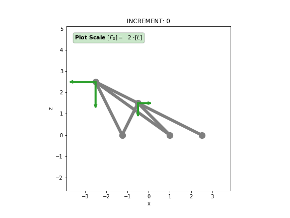
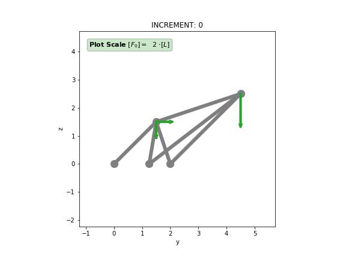
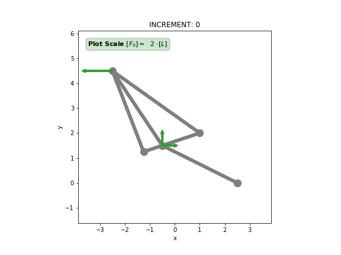
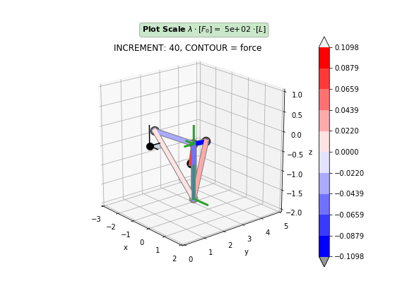
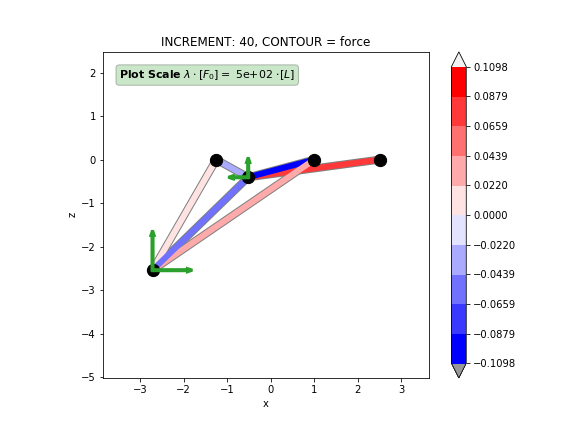
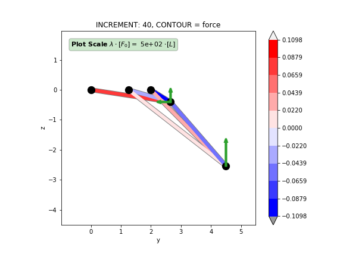
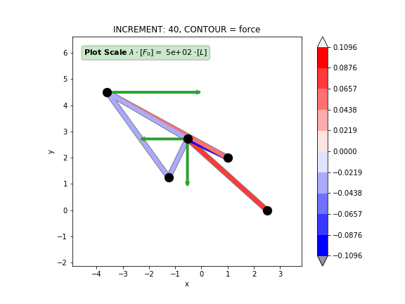

Example NTA-A "3D Truss System"
===============================

This example describes a three-dimensional system of trusses with 5 Nodes and 6 Elements (in total 5 active DOF). Given to it's geometry strong geometric nonlinearities are to be excepted when the given reference load is applied. The model is shown in different views: a general 3D-view and views in XZ-,YZ- and XY-planes. The force vectors of the reference load are illustrated in green, where the force scale is denoted separated on each figure. Within the 3D-view the coordinate system is indicated as a black tripod with a big black dot at the origin point. The XY-plane is illustrated with a semi-transparent light blue fill.
   
.. figure:: data_eNTA-A/model_undeformed_inc0_3d.*
   :scale: 100%
   :align: center
   :alt: 3D-view on the undeformed model with **External Force** vectors acting on **Node** 4 and **Node** 5.
   
Model creation
--------------

First we import trusspy with it's own namespace and create a Model object ``M``. By explicitly enforcing a logfile creation all incremental solution informations are stored in a file `analysis.log` instead of printing it to the interactive shell window.

.. code:: python

    import trusspy as tp

    # init model
    M = tp.Model(logfile=True)
    
Now we create Nodes with coordinate triples and Elements with a list of node connectivities and both material and geometric properties. Both Nodes and Elements are identified with their label. To keep the code clean we'll use the `with` statement for the model creation process.

.. code:: python

   with M.Nodes as MN:
       MN.add_node( 1, coord=( 2.5 , 0   , 0  ))
       MN.add_node( 2, coord=(-1.25, 1.25, 0  ))
       MN.add_node( 3, coord=( 1   , 2   , 0  ))
       MN.add_node( 4, coord=(-0.5 , 1.5 , 1.5))
       MN.add_node( 5, coord=(-2.5 , 4.5 , 2.5))

       
.. code:: python

   element_type   = 1    # truss
   material_type  = 1    # linear-elastic
   
   youngs_modulus = 1.0

   with M.Elements as ME:
       ME.add_element( 1, conn=(1,4), gprop=[0.75] )
       ME.add_element( 2 ,conn=(2,4), gprop=[1   ] )
       ME.add_element( 3, conn=(3,4), gprop=[0.5 ] )
       ME.add_element( 4, conn=(3,5), gprop=[0.75] )
       ME.add_element( 5, conn=(2,5), gprop=[1   ] )
       ME.add_element( 6, conn=(4,5), gprop=[1   ] )
       
       ME.assign_etype("all", element_type)
       ME.assign_mtype("all", material_type)
       ME.assign_material("all", [youngs_modulus])
       

Beside Nodes and Elements we have to define Mechanical (U) Boundaries and External Forces. If a node does not contain Boundaries or External Forces the corresponding entries are added automatically by TrussPy.
       
.. code:: python
       
   with M.Boundaries as MB:
       MB.add_bound_U( 1, (0,0,0) )
       MB.add_bound_U( 2, (0,0,0) )
       MB.add_bound_U( 3, (0,0,0) )
       MB.add_bound_U( 5, (1,0,1) )
       
   with M.ExtForces as MF:
       MF.add_force( 4, ( 1, 1,-1) )
       MF.add_force( 5, (-2, 0,-2) )
       

   

       
Now that the model is finished some additional Settings have to be chosen. Initial allowed incremental system vector components for both the displacement vector and the load-proportionality-factor have to be specified. We use `dlpf = 0.005` and `du = 0.05` (figured out after some trial and error). Both parameters can't be specified automatically as they depend on the model configuration.

.. code:: python

   M.Settings.dlpf = 0.005
   M.Settings.du = 0.05
   
Next the job will be limited to a total amount of 190 increments (again, the total number has been figured out after some job runs to get good looking plots).
   
.. code:: python
   
   M.Settings.incs = 163
   
To speed up the calculation and make the model solution process more robust against a poorly defined initinal incremental system vector an automatic incremental step-size control is activated (`stepcontrol = True`). A maximum factor of `maxfac = 4` limits the increase of the incremental values. If the solution converges but the incremental system vector is bigger than the one specified a total overshoot factor of `dxtol = 1.25` is allowed.
   
.. code:: python
   
   M.Settings.stepcontrol = True
   M.Settings.maxfac = 4
   
   M.Settings.ftol = 8
   M.Settings.xtol = 8
   M.Settings.nfev = 8
   
   M.Settings.dxtol = 1.25
   
Build & Run the Model
---------------------

As the Model creation is finished we may start the calculation process by calling the two Model methods `build()` and `run()`. During the build process the model components will be sorted according to their label. Missing entries (e.g. nodes with zero external force vector) are automatically added. The `run()` method finally starts the calculation.

.. code:: python

    M.build()
    M.run()
    
Verify the Results
------------------
    
After the job has finished the logfile contains useful information regarding convergence, recycles and control components. At the end of the logfile the total execution time during the `run()` method was measured with 6.7 seconds.

.. code-block:: none

   # LOGFILE "analysis.log"

   total  cpu time "build":      0.001 seconds
   total wall time "build":      0.001 seconds

   total  cpu time "run":      6.739 seconds
   total wall time "run":      6.737 seconds
   
For example at increment 40 a converged solution was obtained within 4 iterations plus one iteration to get the new control component. The determination of the control component is based on a linear solution (only 1 Newton-Rhapson iteration) for the current allowed incremental LPF. The sign of this allowed incremental LPF is estimated with the sign of the determinant of the stiffness matrix `det(KT)`. The vector norm of the equilibrium equations and the incremental system vector both satisfy the specified tolerance `tol = 1e-8` at the end of the increment. The 5th component of the incremental system vector (+DOF 5) is used as control component for the path tracing algorithm. No overshoot is detected - the control equation was fullfilled. The 2nd biggest displacement is -DOF 4 with a relative displacement of `-0.3168` compared to the allowed value. As the maximum incremental stepwidth was already reached in increment 8 and that there were no convergence problemes during this increment the allowed incremental system vector is whether increased nor decreased by the automatic stepcontrol. The final LPF at the end of increment 40 is `LPF(inc 40) = -0.003547`.

+---+------+-------+---------+---------+-----------+-----------+-----------+-----------+
|                     INCREMENT   40                                                   |
+===+======+=======+=========+=========+===========+===========+===========+===========+
|                  |       Norm        |        sorted Dx/Dxmax (descending)           |
+---+------+-------+---------+---------+-----------+-----------+-----------+-----------+
|Cyc|NR-It.|Control|    Eq.  |   dx    | i:  Value | i:  Value | i:  Value | i:  Value |
+---+------+-------+---------+---------+-----------+-----------+-----------+-----------+
| 1 |  pre |   6   |1.149e+00|4.779e+00| 5:   2e+01|           |           |           |
+---+------+-------+---------+---------+-----------+-----------+-----------+-----------+
|   |   1  |       |2.499e-03|2.161e-01|           |           |           |           |
+---+------+-------+---------+---------+-----------+-----------+-----------+-----------+
|   |   2  |       |3.514e-06|6.512e-03|           |           |           |           |
+---+------+-------+---------+---------+-----------+-----------+-----------+-----------+
|   |   3  |       |2.143e-11|1.435e-05|           |           |           |           |
+---+------+-------+---------+---------+-----------+-----------+-----------+-----------+
|   |   4  |       |2.072e-16|1.108e-10|           |           |           |           |
+---+------+-------+---------+---------+-----------+-----------+-----------+-----------+
|tot| sum  | used  |  final  |  final  |   final                                       |
+---+------+-------+---------+---------+-----------+-----------+-----------+-----------+
| 1 |   4  |   5   |2.072e-16|1.108e-10| 5:  1.0000| 4: -0.3168| 3:  0.2030| 2:  0.0502|
+---+------+-------+---------+---------+-----------+-----------+-----------+-----------+
|                                                                                      |
| * final LPF:  -0.003547                                                              |
+---+------+-------+---------+---------+-----------+-----------+-----------+-----------+
   
In addition to the biggest components of the relative incremental system vector the Result object inside the Model also contains the absolute values. The results are printed below.

.. code:: python

   >>> M.Results.R[40].U - M.Results.R[39].U
   array([[ 0.        ,  0.        ,  0.        ],
          [ 0.        ,  0.        ,  0.        ],
          [ 0.        ,  0.        ,  0.        ],
          [-0.00316   ,  0.01003059,  0.04060547],
          [-0.06335354,  0.        ,  0.2       ]])
   
   >>> M.Results.R[40].Ured - M.Results.R[39].Ured
   array([-0.00316   ,  0.01003059,  0.04060547, -0.06335354,  0.2       ])
   
   >>> M.Results.R[40].dVmax
   array([0.2 , 0.2 , 0.2 , 0.2 , 0.2 , 0.02])
   
With this information at hand it is shown that DOF 5 is the biggest incremental displacement component (in positive direction). The total displacement vector and LPF factor for increment 40 is accesible via the Model Result:

.. code:: python

   >>> M.Results.R[40].lpf
   -0.0035474199465762137
   
   >>> M.Results.R[40].U
   array([[ 0.        ,  0.        ,  0.        ],
          [ 0.        ,  0.        ,  0.        ],
          [ 0.        ,  0.        ,  0.        ],
          [-0.03397299,  1.21931575, -1.66109327],
          [-1.09743012,  0.        , -3.40464559]])
          
   >>> M.Results.R[40].Ured
   array([-0.03397299,  1.21931575, -1.66109327, -1.09743012, -3.40464559])
   
The element forces for increment 40 are

.. code:: python

   >>> M.Results.R[40].element_force
   array([[ 0.08230657],
          [-0.03135514],
          [-0.109559  ],
          [ 0.05063536],
          [-0.0412221 ],
          [-0.03236385]])
          
and the corresponding strains in the elements are evaluated with the stretches:

.. code:: python

   >>> M.Results.R[40].stretch - 1
   array([[ 0.10974209],
          [-0.03135514],
          [-0.219118  ],
          [ 0.06751382],
          [-0.0412221 ],
          [-0.03236385]])
          
The system equilibrium equations are displayed for the whole system and are reshaped to `(nnodes,ndim)`.

.. code:: python

   >>> M.Results.R[40].g.reshape(M.nnodes,M.ndim)
   array([[-6.12431121e-02,  5.48915100e-02, -3.25179328e-03],
          [ 9.87502262e-03, -6.06477963e-02,  1.21489498e-02],
          [ 5.49155094e-02, -2.24698313e-02,  1.74510337e-03],
          [ 1.83013327e-16,  4.77048956e-17, -1.47451495e-17],
          [ 8.15320034e-17,  2.46786976e-02,  1.73472348e-17]])
          
If we take only the active DOF from this vector and plot it as flattened array it is shown that the equilibrium is fullfilled. Another check is performed with the interal force and external force vector at increment 40, which shows the same result as `g`.

.. code:: python

   >>> M.Results.R[40].g.take(M.nproDOF1)
   array([ 1.83013327e-16,  4.77048956e-17, -1.47451495e-17,  8.15320034e-17,  1.73472348e-17])
   
   >>> (-M.Results.R[40].r + M.Results.R[40].lpf * M.ExtForces.forces).take(M.nproDOF1)
   array([ 1.83013327e-16,  4.77048956e-17, -1.47451495e-17,  8.15320034e-17,  1.73472348e-17])
   
   
Model Plot and Node History
---------------------------
   
To visualize the deformed state of the model for increment 40 some model plots are generated. First the undeformed configuration is generated for different views.

..  code:: python

    # undeformed views
    fig, ax = M.plot_model(
        view="3d",  # 'xy', 'yz', 'xz'
        contour="force",
        lim_scale=(-3, 2, 0, 5, -1, 4),  # 3d
        # lim_scale=1.4, # plane-view
        force_scale=5.0,  # 2
        inc=0,
    )
    fig.savefig("model_undeformed_inc0_3d.pdf")
    fig.savefig("model_undeformed_inc0_3d.png")

For the deformed model the figures are generated with the following code:

.. code:: python

   fig, ax = M.plot_model(
       view="xz", contour="force", lim_scale=1.3, force_scale=500.0, inc=40
   )

   fig, ax = M.plot_model(
       view="3d",
       contour="force",
       lim_scale=(-3, 2, 0, 5, -2, 3),
       force_scale=500.0,
       inc=40,
   )
                

                

   

   

   
Animation of the Deformation Process
------------------------------------

The evolution of the deformation process is visualized with the help of an animated GIF file.

.. figure:: data_eNTA-A/movie_3d.gif
   :width: 100%
   :align: center
   :alt: Animation of the deformation process.
   
Path-Tracing of the Displacement-LPF curves
-------------------------------------------

The path-tracing of the deformation process is shown as a History Plot of Displacement-LPF curves for all active DOF. Strong geometrical nonlinearities are observed for all active DOF.

.. figure:: data_eNTA-A/history_node45_DispX-LPF.*
   :scale: 100%
   :align: center
   :alt: Displacement X vs. LPF-factor for **Node** 4 and **Node** 5.
   
.. figure:: data_eNTA-A/history_node45_DispY-LPF.*
   :scale: 100%
   :align: center
   :alt: Displacement Y vs. LPF-factor for **Node** 4 and **Node** 5.
   
.. figure:: data_eNTA-A/history_node45_DispZ-LPF.*
   :scale: 100%
   :align: center
   :alt: Displacement Z vs. LPF-factor for **Node** 4 and **Node** 5.