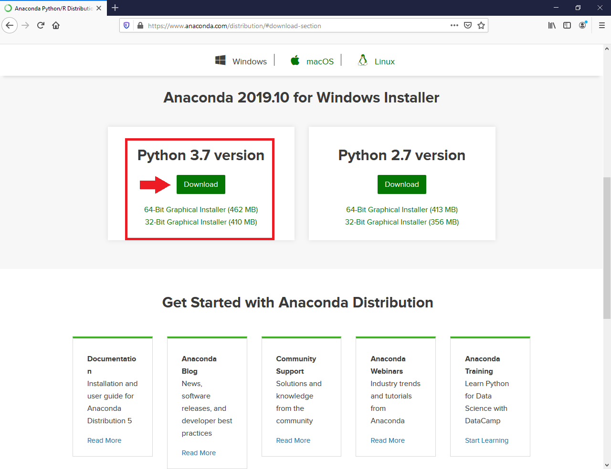

Installation
============

Python Distribution
-------------------

It is recommended to start with installing a full-featured Python-Distribution like Anaconda_ (available for Windows, macOS and Linux). This will install a bunch of useful additional tools beside the basic Python installer: JupyterLab_, Notebook_, Spyder_, `conda` Environment Manager, Anaconda Navigator and all the scientific Python Packages (NumPy, SciPy, MatPlotLib, Pandas, ...).

   
   Download Anaconda

Download and install Anaconda_ (Version 3.x) for your operation system. (Help on Installation_).

Download and Install TrussPy
----------------------------

TrussPy is available as a package on PyPi_ (the Python Package Index). The source code of the development version is published on GitHub_. For installing TrussPy with `pip` open a terminal window:

a) Windows: From the Start menu, search for and open “Anaconda Prompt”.
b) macOS: Open Launchpad, then click the terminal icon.
c) Linux: Open a terminal window.

.. figure:: images/anaconda-cmd.png
   :width: 75%
   :align: center
   :alt: Install TrussPy
   
   Install TrussPy

Inside the terminal window type

.. code:: bash

    pip install trusspy
	
to download and install TrussPy.

Run a Notebook
--------------

Start Anaconda Navigator_, Launch **Notebook** from the Home Tab and wait for the Browser Window to open.

.. figure:: images/anaconda-navigator.png
   :width: 75%
   :align: center
   :alt: Anaconda Navigator
   
   Anaconda Navigator
   
Navigate to a path where you would like to store the TrussPy notebooks. Create a new Notebook by clicking the **New** button located top right. Select **Python 3** from the dropdown list. The new Notebook will open in a new browser window. Each cell is executed with SHIFT-ENTER or the **Run** Button.

.. figure:: images/jupyter-notebook.png
   :width: 50%
   :align: center
   :alt: Jupyter Notebook
   
   Jupyter Notebook
   
Continue with one of the :doc:`../examples/examples`.

.. _Anaconda: https://www.anaconda.com/distribution/#download-section

.. _Navigator: https://docs.anaconda.com/anaconda/navigator/getting-started/#navigator-starting-navigator

.. _Installation: https://docs.anaconda.com/anaconda/install/

.. _JupyterLab: https://jupyter.org/

.. _Notebook: https://jupyter.org/

.. _Spyder: https://www.spyder-ide.org/

.. _GitHub: https://github.com/adtzlr/trusspy

.. _PyPi: https://pypi.org/project/trusspy/

.. _WinPython: https://winpython.github.io/

.. _ZIP-file: https://github.com/adtzlr/trusspy/archive/master.zip